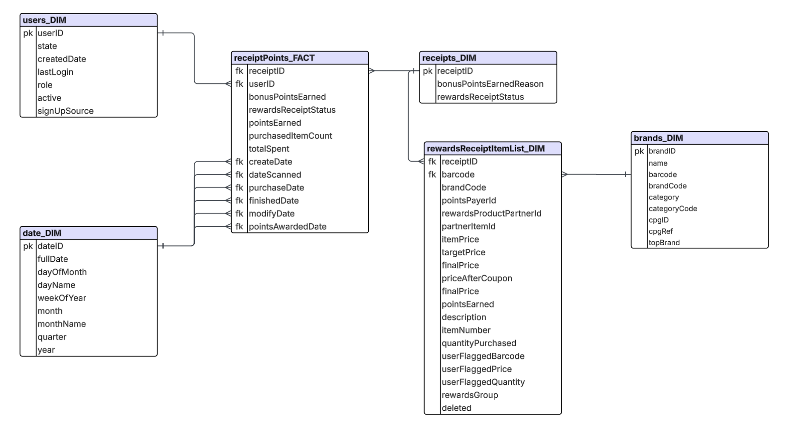

# Fetch Take Home Test - Analytics Engineer

## Overview

This repository contains the completed Fetch Rewards Data Engineering assessment. The exercise involved structuring unstructured JSON data into a relational model, writing SQL queries to answer business questions, identifying data quality issues, and effectively communicating findings to stakeholders.

## Data Modeling

I have normalized the three unstructured JSON files (Receipts, Users, and Brands) and cleansed the data. The rewardsReceiptItemList column in the Receipts dataset contained a list of dictionaries describing purchased items, which I further normalized into a separate table. As a result, I have structured the data using a Snowflake Schema, ensuring efficiency and ease of querying.

The relational diagram depicting the structured data model has been included in this repository.

## Project Structure
The repository is organized as follows:
- Relational Diagram: A diagram showcasing the structured relational model is included.
- scripts Folder:
  - FlatteningRawFile.ipynb: Contains Python code used for normalizing and structuring the raw JSON data.
  - StakeholderAnswers.ipynb: SQL queries that answer the stakeholder’s business questions.
  - DataQualityIssue.ipynb: Queries and analysis identifying data quality issues.
- StakeholderEmail.pdf: Contains message for a business leader, showcasing my data communication skills.
